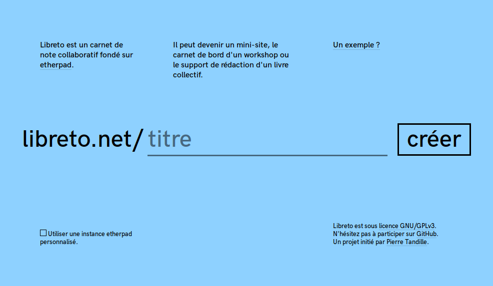

<!--
N.B.: This README was automatically generated by https://github.com/YunoHost/apps/tree/master/tools/README-generator
It shall NOT be edited by hand.
-->

# Libreto for YunoHost

[](https://dash.yunohost.org/appci/app/libreto)  

[](https://install-app.yunohost.org/?app=libreto)

*[Lire ce readme en français.](./README_fr.md)*

> *This package allows you to install Libreto quickly and simply on a YunoHost server.
If you don't have YunoHost, please consult [the guide](https://yunohost.org/#/install) to learn how to install it.*

## Overview

Libreto is a collaborative etherpad-based notebook. It can become a mini-site, the synopsis of a workshop or the support for writing a collective book.


**Shipped version:** 0.0.20180605~ynh5

**Demo:** https://libreto.net

## Screenshots




## Documentation and resources

* Official app website: <https://libreto.net>
* Upstream app code repository: <https://github.com/Ventricule/libreto>
* YunoHost documentation for this app: <https://yunohost.org/app_libreto>
* Report a bug: <https://github.com/YunoHost-Apps/libreto_ynh/issues>

## Developer info

Please send your pull request to the [testing branch](https://github.com/YunoHost-Apps/libreto_ynh/tree/testing).

To try the testing branch, please proceed like that.

``` bash
sudo yunohost app install https://github.com/YunoHost-Apps/libreto_ynh/tree/testing --debug
or
sudo yunohost app upgrade libreto -u https://github.com/YunoHost-Apps/libreto_ynh/tree/testing --debug
```

**More info regarding app packaging:** <https://yunohost.org/packaging_apps>
