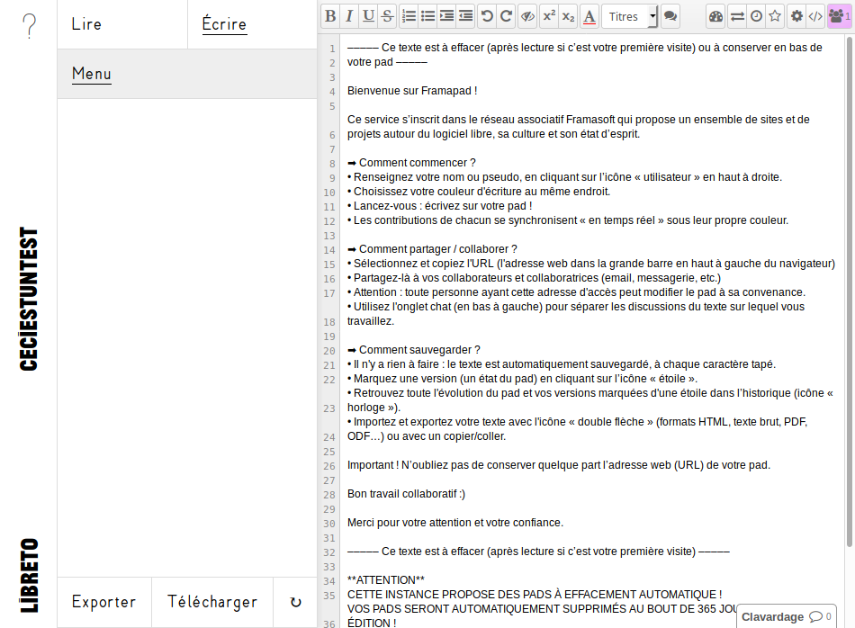

<!--
Nota bene : ce README est automatiquement généré par <https://github.com/YunoHost/apps/tree/master/tools/readme_generator>
Il NE doit PAS être modifié à la main.
-->

# Libreto pour YunoHost

[](https://ci-apps.yunohost.org/ci/apps/libreto/)


[](https://install-app.yunohost.org/?app=libreto)

*[Lire le README dans d'autres langues.](./ALL_README.md)*

> *Ce package vous permet d’installer Libreto rapidement et simplement sur un serveur YunoHost.*  
> *Si vous n’avez pas YunoHost, consultez [ce guide](https://yunohost.org/install) pour savoir comment l’installer et en profiter.*

## Vue d’ensemble

Libreto est un carnet de note collaboratif fondé sur etherpad. Il peut devenir un mini-site, le carnet de bord d'un workshop ou le support de rédaction d'un livre collectif.


**Version incluse :** 2024.07.05~ynh1

**Démo :** <https://libreto.net>

## Captures d’écran



## :red_circle: Anti-fonctionnalités

- **Application non maintenue **: Ce logiciel n'est plus maintenu. Attendez-vous à ce qu'il ne fonctionne plus avec le temps, et que l'on découvre des failles de sécurité qui ne seront pas corrigées, etc.

## Documentations et ressources

- Site officiel de l’app : <https://libreto.net>
- Dépôt de code officiel de l’app : <https://github.com/Ventricule/libreto>
- YunoHost Store : <https://apps.yunohost.org/app/libreto>
- Signaler un bug : <https://github.com/YunoHost-Apps/libreto_ynh/issues>

## Informations pour les développeurs

Merci de faire vos pull request sur la [branche `testing`](https://github.com/YunoHost-Apps/libreto_ynh/tree/testing).

Pour essayer la branche `testing`, procédez comme suit :

```bash
sudo yunohost app install https://github.com/YunoHost-Apps/libreto_ynh/tree/testing --debug
ou
sudo yunohost app upgrade libreto -u https://github.com/YunoHost-Apps/libreto_ynh/tree/testing --debug
```

**Plus d’infos sur le packaging d’applications :** <https://yunohost.org/packaging_apps>
